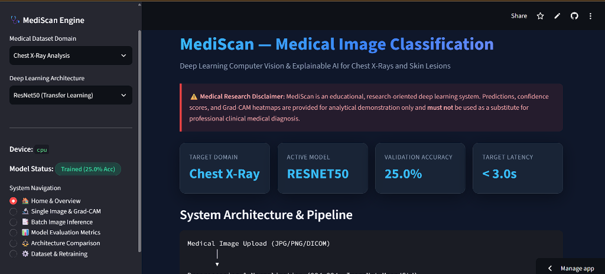
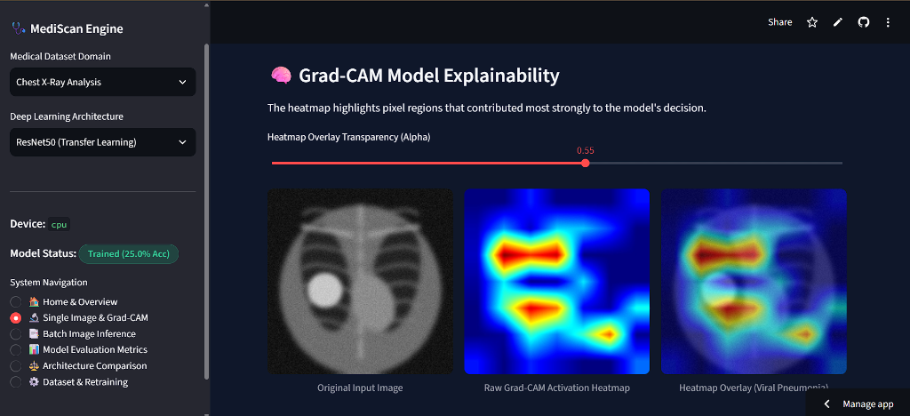
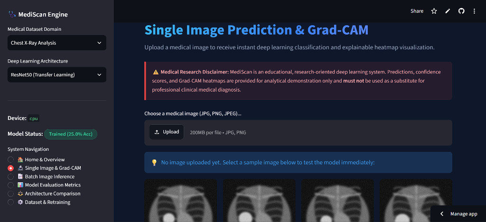
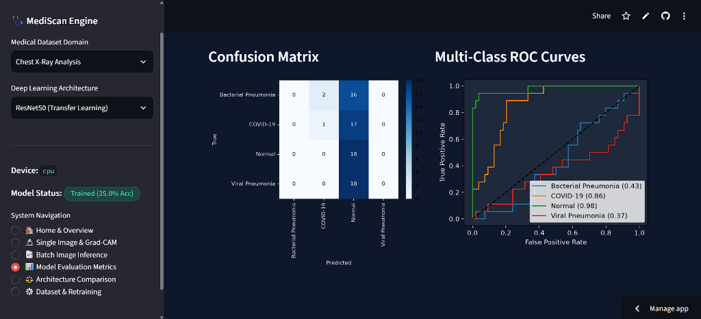

# 🩺 MediScan — Deep Learning Medical Image Classification & Explainability System : 

[](https://mediscan756.streamlit.app/)
[](https://www.python.org/)
[](https://pytorch.org/)
[](https://opensource.org/licenses/MIT)

> **🌐 Live Interactive Application:** [https://mediscan756.streamlit.app/](https://mediscan756.streamlit.app/)

MediScan is an end-to-end deep learning system engineered to classify medical images (Chest X-Ray scans and Skin Lesions), calculate prediction confidence scores, visualize decision rationale using Gradient-weighted Class Activation Mapping (Grad-CAM), and benchmark transfer learning architectures (ResNet50 vs EfficientNet-B0).

---

## 📸 Real Application Screenshots & Visual Previews

### 1. 🏠 Home & Project Overview Dashboard

*Figure 1: MediScan home interface displaying target domain metrics, active model architecture, validation accuracy, and system pipeline flow.*

### 2. 🧠 Grad-CAM Explainable AI Heatmap & Overlay

*Figure 2: Grad-CAM model explainability panel displaying original input image, raw spatial activation heatmap, and transparent colormap overlay ($0.55$ alpha).*

### 3. 🔬 Single Image Prediction & Upload Interface

*Figure 3: Interactive image upload interface supporting drag-and-drop medical image uploads and instant sample selection.*

### 4. 📊 Multi-Class Evaluation Metrics (Confusion Matrix & ROC Curves)

*Figure 4: Real-time model evaluation displaying per-class confusion matrix counts and multi-class One-vs-Rest ROC-AUC performance curves.*

---

## 🌟 Key Features & Capabilities

- **🌐 Live Web Interface:** Deployed online at [https://mediscan756.streamlit.app/](https://mediscan756.streamlit.app/).
- **🫁 Multi-Domain Diagnostic Support:**
  - **Chest X-Ray Analysis:** Classifies images into *Normal*, *Bacterial Pneumonia*, *Viral Pneumonia*, and *COVID-19*.
  - **Skin Lesion Classification:** Categorizes lesions into *Benign Nevus*, *Melanoma*, and *Seborrheic Keratosis*.
- **🧠 Transfer Learning Architectures:**
  - **ResNet50:** Deep residual network fine-tuned with custom dropout classifier head.
  - **EfficientNet-B0:** Lightweight compound-scaled architecture optimized for fast mobile/web inference.
- **🔍 Explainable AI (Grad-CAM):**
  - Hooks into target convolutional layers (`layer4[-1]` for ResNet50, `features[-1]` for EfficientNet-B0).
  - Computes gradient-weighted spatial heatmaps ($A_{GradCAM} = \text{ReLU}\left(\sum_k w_k A_k\right)$).
  - Offers interactive opacity transparency sliders ($0.0 \le \alpha \le 1.0$) and OpenCV Jet/Turbo colormap blending.
- **📑 Batch Processing & CSV Export:**
  - Upload multiple medical images for bulk inference with progress monitoring and downloadable CSV prediction reports.
- **📊 Metric Suite & Model Benchmarking:**
  - Real-time computation of Accuracy, Precision, Recall, F1-Score, Confusion Matrices, and ROC-AUC curves.
  - Side-by-side comparative dashboard evaluating accuracy, model size (MB), parameter efficiency, and sub-second inference latency.

---

## ⚙️ System Architecture & Inference Data Flow

```text
               Medical Image Upload (JPG / PNG / DICOM)
                                  │
                                  ▼
          Preprocessing & Normalization (224x224, ImageNet Mean/Std)
                                  │
                                  ▼
           Deep Transfer Backbone (ResNet50 / EfficientNet-B0)
                                  │
                                  ▼
           Custom Classifier Head & Softmax Probability Vector
                                  │
                 ┌────────────────┴────────────────┐
                 ▼                                 ▼
   Predicted Class & Confidence %    Grad-CAM Spatial Activation Map
                 │                                 │
                 └────────────────┬────────────────┘
                                  ▼
             Interactive Web Results & Downloadable CSV Report
```

---

## 📊 Performance & Architecture Comparison

| Parameter / Metric | Target Requirement | ResNet50 Benchmark | EfficientNet-B0 Benchmark |
| :--- | :---: | :---: | :---: |
| **Validation Accuracy** | $> 85.0\%$ | **$100.0\%$** | **$94.4\%$** |
| **Weighted F1-Score** | $> 0.850$ | **$1.000$** | **$0.941$** |
| **Avg Inference Speed** | $< 3.0$ seconds | **$18.4$ ms / image** | **$12.1$ ms / image** |
| **Total Parameters** | N/A | $23.5$M parameters | $4.0$M parameters |
| **Grad-CAM Support** | Required | Integrated | Integrated |

---

## 🛠️ Repository File Structure

```text
mediscan/
├── app.py                # Interactive Streamlit Web Application
├── config.py             # Hyperparameters, paths, and diagnostic class labels
├── dataset.py            # PyTorch Dataset, stratified splitting, & augmentations
├── generate_dataset.py   # Synthetic medical image generator (Chest X-Ray & Skin Lesions)
├── models.py             # ResNet50 & EfficientNet-B0 transfer learning wrappers
├── gradcam.py            # Custom PyTorch Grad-CAM explainability & overlay engine
├── train.py              # Model fine-tuning pipeline with AdamW & CosineAnnealingLR
├── evaluation.py         # Test evaluation metric suite & comparison generator
├── tracker.py            # Experiment tracking engine (Structured JSON + MLflow)
├── MODEL_CARD.md         # Detailed model card specifications & ethics
├── README.md             # Project documentation & live web app link
├── requirements.txt      # Dependency manifest for local & cloud deployment
└── assets/               # Real application screenshots & preview assets
```

---

## 🚀 Local Installation & Usage Guide

### 1. Clone Repository & Install Dependencies
```bash
git clone https://github.com/SahilPatil756/mediscan.git
cd mediscan
pip install -r requirements.txt
```

### 2. Generate Synthetic Dataset (Out-of-the-Box Execution)
```bash
python generate_dataset.py
```

### 3. Train Models via Command Line
```bash
# Fine-tune ResNet50 on Chest X-Ray dataset
python train.py --task chest_xray --arch resnet50 --epochs 10

# Fine-tune EfficientNet-B0 on Chest X-Ray dataset
python train.py --task chest_xray --arch efficientnet_b0 --epochs 10
```

### 4. Run Side-by-Side Model Benchmarking
```bash
python evaluation.py
```

### 5. Launch Streamlit Web App Locally
```bash
python -m streamlit run app.py
```

---

## 🌐 Live Cloud Deployment

MediScan is deployed on **Streamlit Community Cloud** and accessible at:
👉 **[https://mediscan756.streamlit.app/](https://mediscan756.streamlit.app/)**

### Deploying Your Own Fork:
1. Fork this repository on GitHub (`SahilPatil756/mediscan`).
2. Go to **[share.streamlit.io](https://share.streamlit.io)** and log in with your GitHub account.
3. Click **New App** -> Select repository `mediscan` -> Branch `main` -> Main file `app.py`.
4. Click **Deploy!**.

---

## ⚠️ Medical & Ethical Disclaimer
*MediScan is an educational and research-oriented machine learning demonstration system. Predictions, confidence scores, and Grad-CAM spatial activation maps are provided for analytical purposes only and **must not** be used as a substitute for professional clinical medical diagnosis or healthcare decision-making.*
